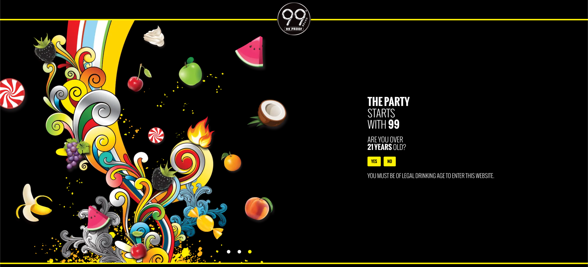

## Age Verification
The age verification block is automatically integrated into every page delivered
if the cookie sazAgeOK is missing. Rejecting the age verification check by clicking no will
bring up the rejection section and automatically redirect after 30 seconds to the defined
link in the rejection section. Accepting the age confirmation will set the sazAgeOK cookie. 
The content for the age verification is administered in templates/verification.docx document (Sharepoint).

### Content Structure

| agegate-logo |
|--------------|
| (img))       |

| verification |
|--------------|
| (h1) text    |
| (a)  text    |
| (a)  text    |

| background |       |
|------------|-------|
| desktop    | (img) |      
| mobile     | (img) |

### Example

