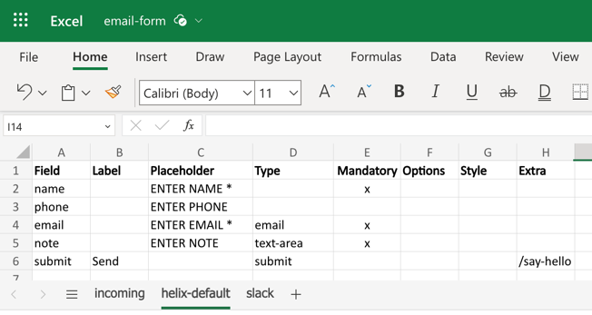
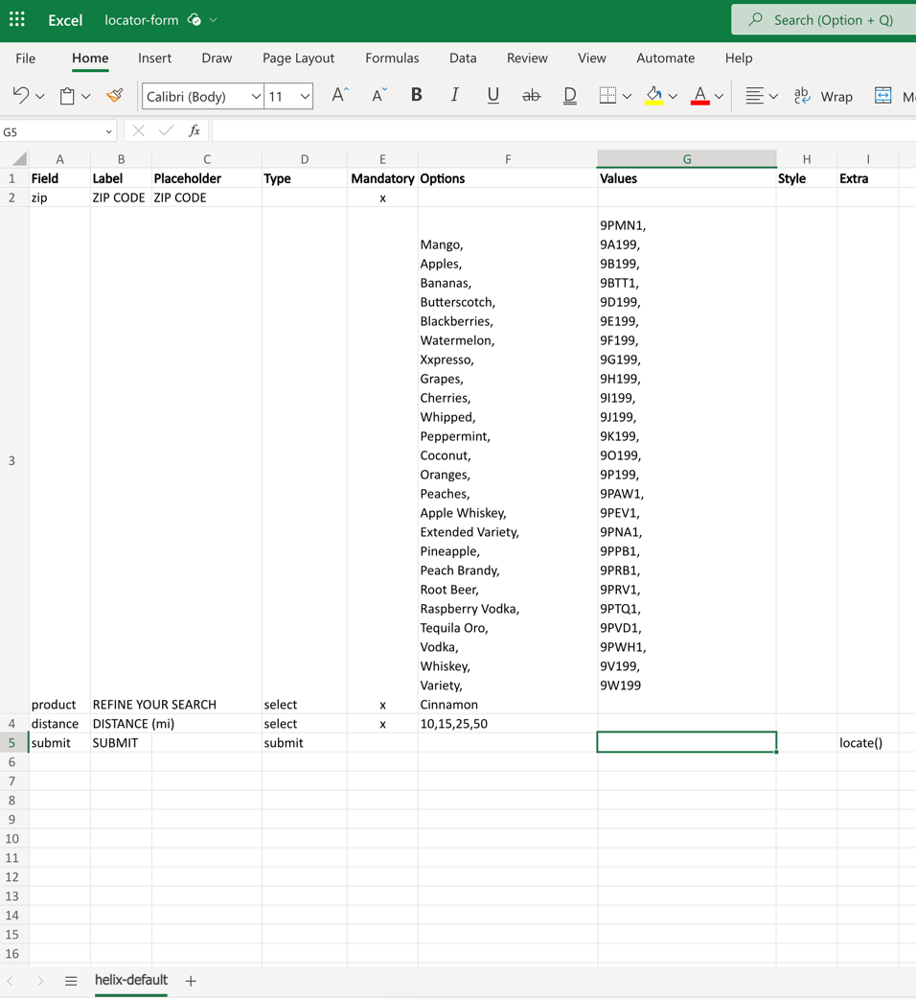
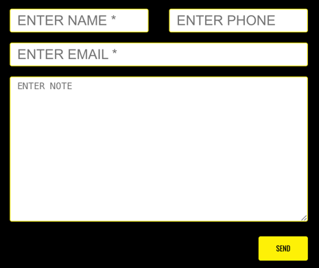
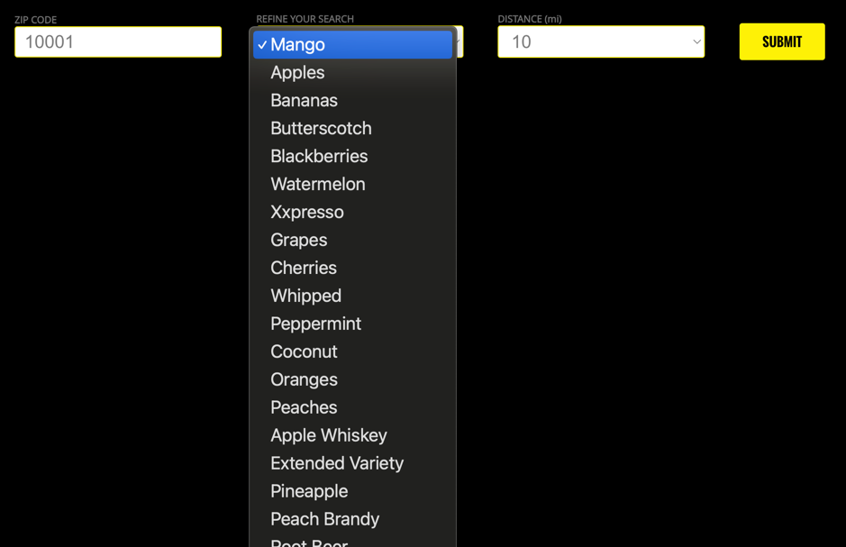
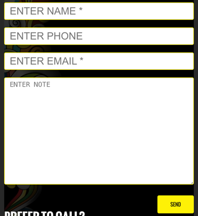
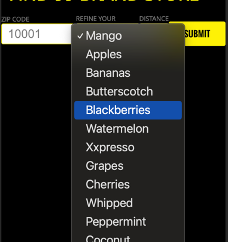

## Form
Allows to track name, phone and email along with a note and send that content in an email. This form can only be used for this purpose, additional fields would need to be implemented additionally.
A special case is the locator form that uses a javascript function on button press.

### Content Structure

| form                           |
|--------------------------------|
| link to sharepoint spreadsheet |

the sharepoint spreadsheet defines the fields available and the redirect after the form is sent. Adding new fileds, however, needs additional changes in the sendmail function.

### Example

#### Desktop

#### Mobile

