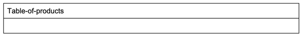
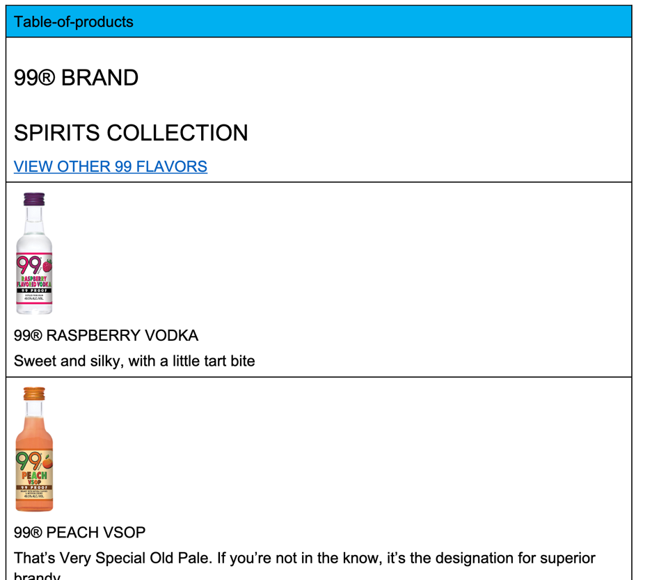
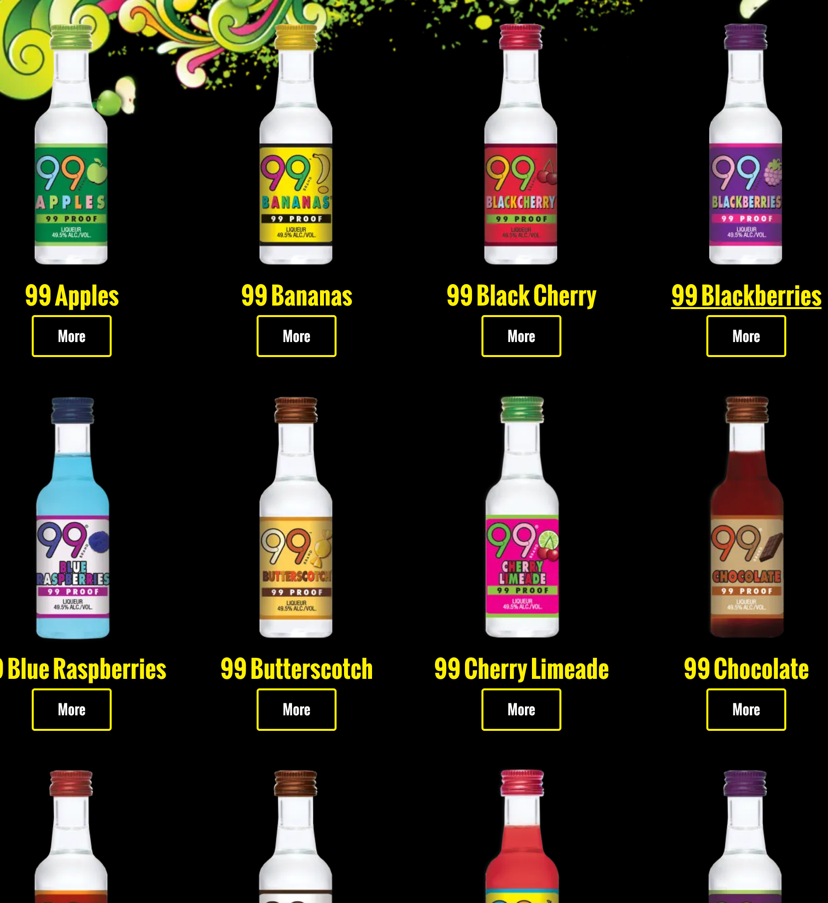
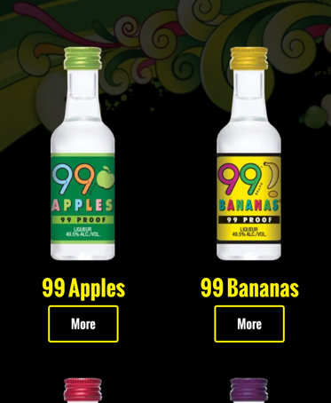

## Table of products

### Content Structure

| table-of-products |
|-------------------|
| --empty--         |

if the table of products is empty, it will simply load all products listed in the /products/ folder instead.

| table-of-products       |
|-------------------------|
| (img) text link |

When there is content in the table of products, it will show that content and not load any products from /products/ folder.

### Example 

#### Desktop

#### Mobile
 
