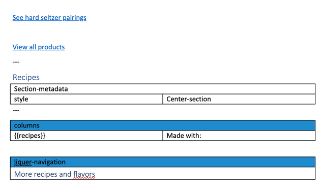
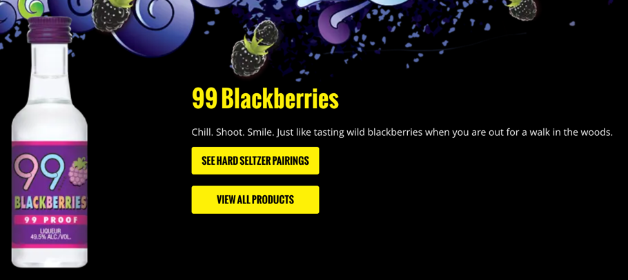
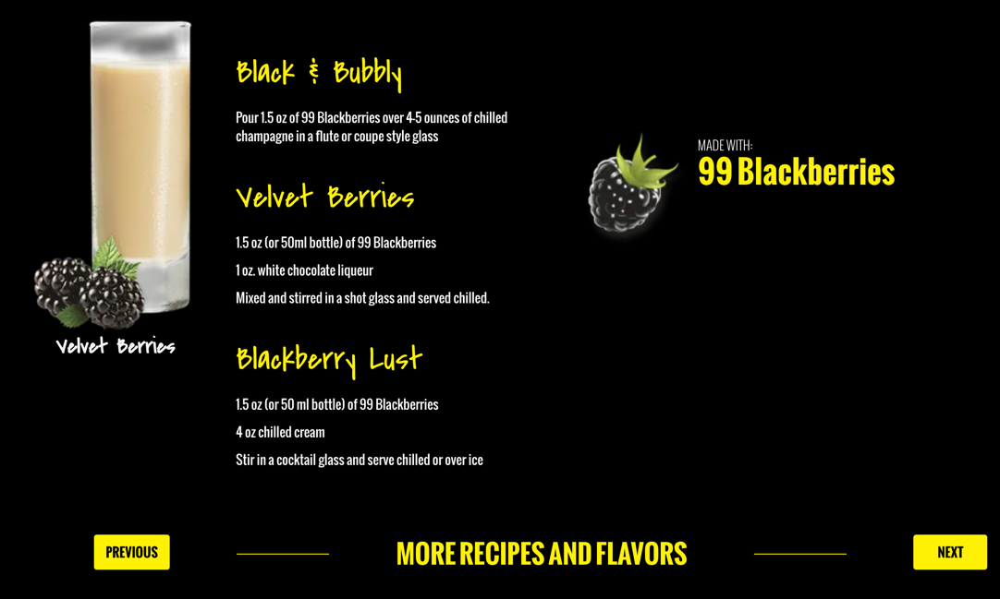
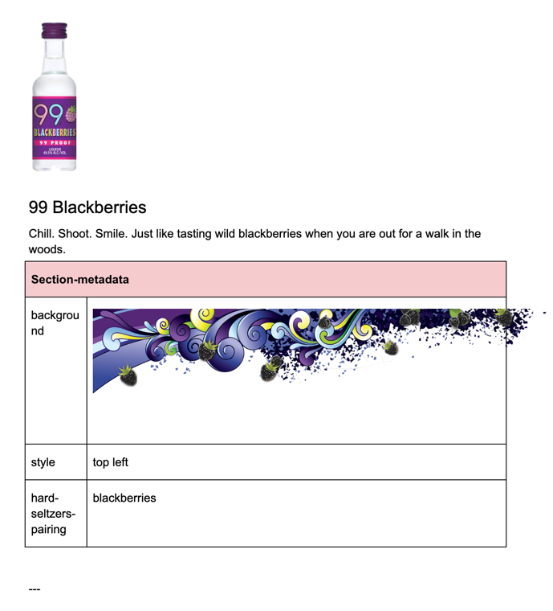
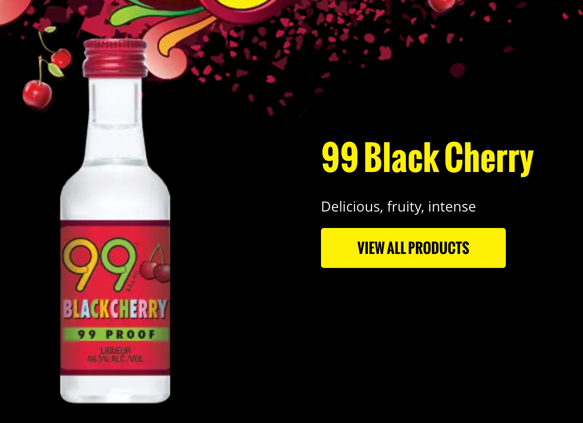
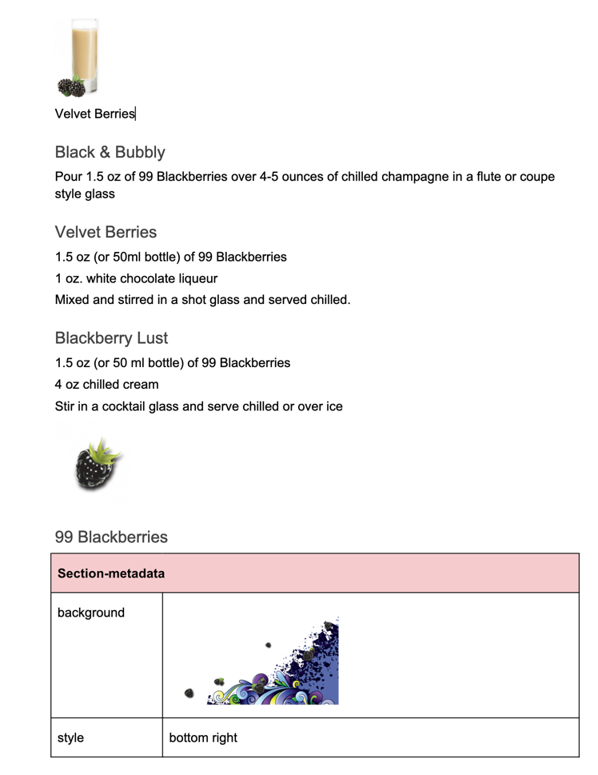

# Liquer templating: How to define a new product

This chapter shows how a new product can be added and how the templating works.

## The template
It is stored in /templates/liquer.docx

There are three sections: the top, the center and the bottom section.

### top section
contains two links to navigate to the pairing page and to show all products.

### center section
Shows the recipes title

### bottom section
Shows the actually recipes and the made with icon, along with the liquer navigation.
 

## How to fill the template
For each product, put a dedicated file with the content to the /products/ folder.
In this example we use the blackberries one.

The sections are configured using a section metadata block.

### top section
  

| Section Metadata      |                                                                                             |
|-----------------------|---------------------------------------------------------------------------------------------|
| background            | an image that is shown as background                                                        |
| Style                 | top left                                                                                    |
| hard-seltzers-pairing | the anchor name as found in https://www.99brandparty.com/hard-seltzer-pairings#blackberries |

If the hard seltzers pairing is not defined, the button is simply not shown:
  

### center section
nothing to do

### bottom section
everything that comes before the last image in this section will be put to the left column, the image and the text afterwards will be put into the right column.
  

| Section Metadata      |                                                                                             |
|-----------------------|---------------------------------------------------------------------------------------------|
| background            | an image that is shown as background                                                        |
| Style                 | bottom right                                                                                |
